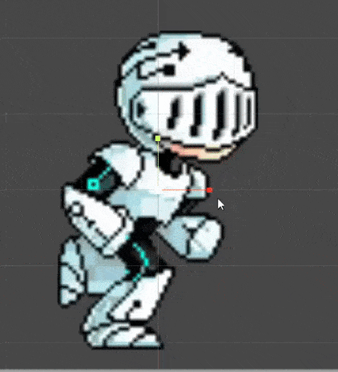
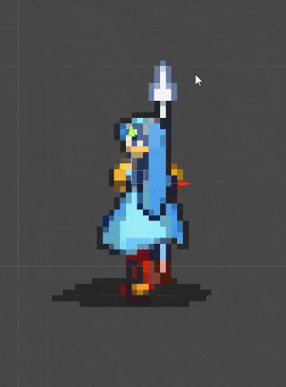
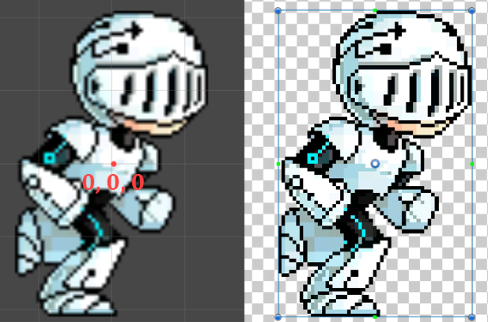
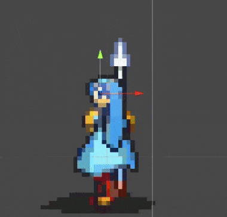
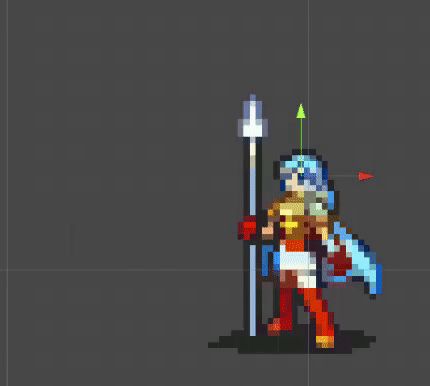
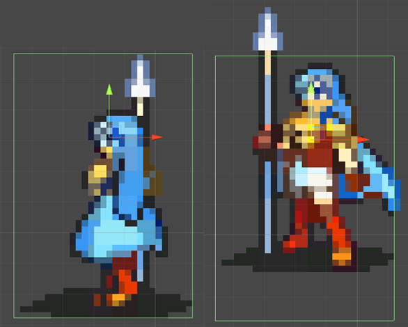
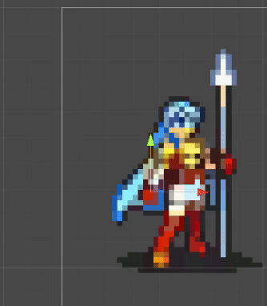

# 2D Animation in Unity with different sprite sizes

<time datetime="2020-05-24">24 May, 2020</time>

Creating 2D animations in Unity can be difficult if the sprites have different sizes. It's possible to standardize the sprite size by scaling to the biggest one, however this may require a bigger sprite sheet and that's not a good solution performance wise. This tutorial explains one way to set up **pivots** in sprites to assist in those situations.

- [Examples](#examples)
- [Why it happens](#why)
- [How to fix it](#how)
- [Future problems](#future)
- [Example project](#exampleProject)
- [Credits](#credits)

## Examples 

There might have some animations with different sized frames that work well with the standard setup, like [this robot guy](https://opengameart.org/content/animated-runner-character).

.

If you let unity split the sprite sheet automatically, each sprite from the animation cycle will have a different size and still the animation will cycle correctly.

However, others don't go so well and have a strange flickering when changing sprites, like this [Erika's sword attack](https://www.deviantart.com/misskilvas/art/Eirika-with-lance-sprite-sheet-181194797).

## Why it happens 

Every sprite has a pivot that's used for Unity to render it in the scene given the transform position. If a character is at (0, 0, 0) the pivot will be placed in this position, as shown in the image.

The robot's animation works because the pivot is in his chest in **every frame**, which means that it's holding the same position relative to the robot's body. That doesn't happen in Erika's case, since the pivots are in a different relative position for each frame.

## How to fix it 

To fix Erika's animation we must choose a position for the pivot that will be consistent throughout the animations cycle. In this case I used her eye as reference and placed the pivot in her head.

_You can see the pivot point for each frame by looking to the unity transform gizmo in her eye._

To do the same, select the sprite sheet in your resources folder and click in <b>Sprite Editor</b> in the inspector, this will open a tool where you can change the pivot for each one of your sprites.

You can leave the Sprite Editor open to edit both the sprite sheet and the animation in the scene, that'll make the job easier.

For other characters there might have better places for a pivot, just keep in mind that it needs to be consistent in every frame.

In this other animation for Erika, there are poses where she moves her head. I've used the distance between her feet and her head in standing animations to get the right height for each pivot. Be aware that you can put a pivot outside the sprite if necessary.

_In this animation the gizmo shows how the pivot point stand still where her eye was in previous animations._

## Future problems 

Those are some problems you need to be aware when using this approach

### 2D box collider inconsistency

If you've chosen a pivot for one of your characters animation you might have to use the same for other movements for this specific character too. If you use different relative positions for each animation problems with box collider placement may occur.

_Notice how the right sprite doesn't respect the 2D box collider since its pivot has a different reference position._

This will highly depend on how you're setting collision in your project, but using a consistent position for your pivot will definitely help.

### Sprite X flip

Be aware that the chosen pivot will also be important when flipping the sprite. If your game has no flipping animation and the pivot is far from the character's core, this might happen:

To avoid that, place pivots closer to the character core and the flipping will be smoother.

## Example project 

I've created a simple project that holds only Erika's animation, it can be found in my [github](https://github.com/theGusPassos/unity-2d-animation-with-different-sprite-sizes).

## Credits 

- Erika's animation was made by [MissKilvas](https://www.deviantart.com/misskilvas).

- The robot guy animation was made by [irmirx](https://opengameart.org/users/irmirx).
