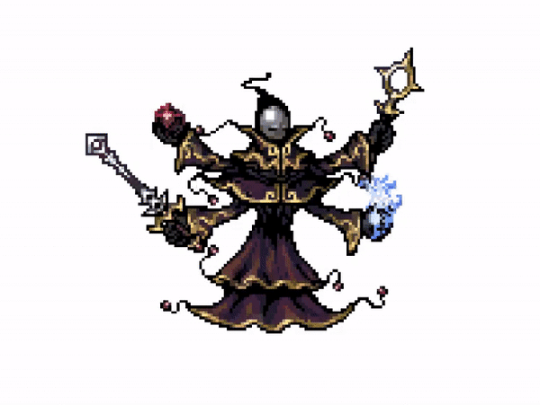
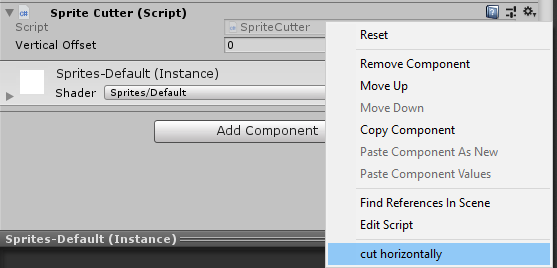
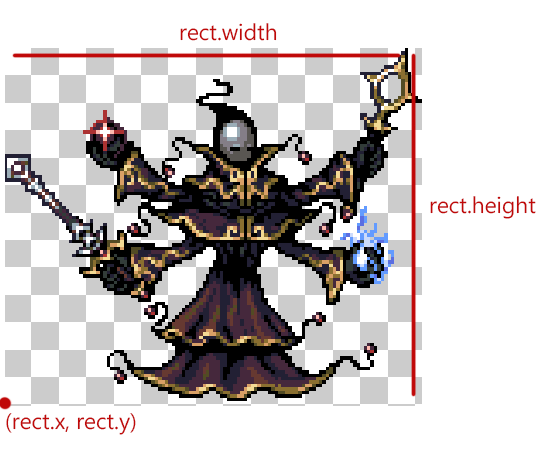

# Cutting sprites in Unity programmatically

<time datetime="2020-06-06">06 Jun, 2020</time>

This tutorial gives one possible solution to a cut sprite effect in Unity with just one script.

There are many approaches to do this, I recommend using the following if you want a reusable script that can create independent objects, allowing you to add any effect to the generated pieces. However, keep in mind that this solution does not cover diagonal cuts, sprites are only split in straight lines.

- [Example scenario](#sprites)
- [Sprite Cutter script](#script)
- [Using the script](#using)
- [Credits and Resources](#credits)

## Example scenario <a name = "sprites"></a>

Given a character that has an animation, the script should cut his sprite in half in a way that each part can be pushed to a different direction.

We must also consider pivots since each sprite may have different sizes and a different pivot position for each one. [This post](https://theguspassos.github.io/blog/#/post/2d-animation-in-unity-with-different-sprite-sizes) covers how to set up an animation with different sprite sizes.

I'm using a sprite sheet from a character made by [Balmer](https://opengameart.org/content/bosses-and-monsters-spritesheets-ars-notoria).



_This is the end result of this tutorial, but keep in mind that you can edit the script to cut the sprite in more parts and add more effects to it._

## Sprite Cutter script <a name = "script"></a>

The first step is to declare the MonoBehaviour class that will contain the method to cut the sprite.

```
public class SpriteCutter : MonoBehaviour
{
    [ContextMenu("Cut sprite from editor")]
    public void CutSpriteFromEditor()
    {
        CutSpriteHorizontally(GetComponent<SpriteRenderer>(), transform.position);
    }

    public GameObject[] CutSpriteHorizontally(
        SpriteRenderer renderer, Vector2 spritePosition)
    { }
}
```

The `CutSpriteFromEditor` method has a `ContextMenu` attribute that allows it to be called from the Unity inspector. You can do it even in the edit mode.



Notice that the method returns an array with references to the new sprites. This is necessary since new behaviour will be added to those parts (like force to different directions) and doing that is not a responsibility for the `SpriteCutter` component.

Inside the `CutSpriteHorizontally` method we will declare the first variables.

```
// this one for simplicity
var spriteToCut = renderer.sprite;

// this one defines the height for each new sprite
var ySpriteSize = spriteToCut.texture.height / 2;
```

Then we can use the texture from the original sprite to create two new sprites, each with half of the original. The problem behind that is the texture.

<div class="important">
<p>
The <code>spriteToCut.texture</code> holds a reference to the <b>entire sprite sheet</b>. Unity knows how to render the right piece of the sprite sheet by referring to the rect property in the sprite.
</p>
<p>
This means that we need to use the rect x and y position as our guide while cutting the sprite.
</p>
</div>

```
var upperSprite = Sprite.Create(
    spriteToCut.texture,
    new Rect(
        spriteToCut.rect.x,
        spriteToCut.rect.y + ySpriteSize,
        spriteToCut.rect.width,
        ySpriteSize),
    Vector2.zero,
    spriteToCut.pixelsPerUnit,
    0,
    SpriteMeshType.FullRect);
```



_The image shows where each value of the rect used is in the sprite sheet for this specific sprite._

- The pivot is set to Vector2.zero and will be placed in the bottom left. This is important since it will be used for later to place the new sprites in the same position as the last one.

- We're keeping the same pixel per unit value as the original sprite to avoid problems with sprites of different sizes.

- Extrude is zero since it's not necessary for this case. [Sprite.Create docs](https://docs.unity3d.com/2018.2/Documentation/ScriptReference/Sprite.Create.html).

- The `SpriteMeshType.FullRect` is important since it's faster, you can read more about it [here](https://adventurecreator.org/forum/discussion/4194/performance-issue-unity-ui-inventory).

Finally we can create the lower body sprite:

```
var lowerSprite = Sprite.Create(
    spriteToCut.texture,
    new Rect(
        spriteToCut.rect.x,
        spriteToCut.rect.y,
        spriteToCut.rect.width,
        ySpriteSize),
    Vector2.zero,
    spriteToCut.pixelsPerUnit,
    0,
    SpriteMeshType.FullRect);
```

Those method calls could have been structured in a loop, but since it's only two sprites it made sense to me to leave it like this for easier readability. Anyway, if you're aiming for more cuts I highly recommend writing a loop.

The next step is to create new game objects that will hold the `SpriteRenderer` component.

```
var upperBody = new GameObject("Upper Body");
var lowerBody = new GameObject("Lower Body");

var upperBodyRenderer = upperBody.AddComponent<SpriteRenderer>();
upperBodyRenderer.sprite = upperSprite;
upperBodyRenderer.material = spriteRenderer.material;

var lowerBodyRenderer = lowerBody.AddComponent<SpriteRenderer>();
lowerBodyRenderer.sprite = lowerSprite;
lowerBodyRenderer.material = spriteRenderer.material;
```

If you run the method in the Unity inspector two new game objects should be placed on the scene. However, their position is messy. Since the pivot for those new sprites are at `(0, 0)` we need to subtract it by the pivot from the original sprite to get the right relative position.

```
var xPivotInUnits = spriteToCut.pivot.x / spriteToCut.pixelsPerUnit;
var yPivotInUnits = spriteToCut.pivot.y / spriteToCut.pixelsPerUnit;

lowerBody.transform.position = spritePosition - new Vector2(xPivotInUnits, yPivot);
```

The lower body is the easiest since it doesn't need to have its height fixed. For the upper body we need to remove lower body's height to make sure it will appear above it.

```
upperBody.transform.position = spritePosition - new Vector2(
                xPivotInUnits,
                yPivotInUnits - (lowerSprite.rect.height / spriteToCut.pixelsPerUnit));
```

Then you can just return those objects as a GameObject array.

```
return new GameObject[] { upperBody, lowerBody };
```

If you try the method once again in the inspector you'll notice that the two new sprites are together and appear to be one, this is wanted since the change between them must be seamless.

## Using the script <a name = "using"></a>

This next script allows the functionality to be used in game. It calls the `CutSpriteHorizontally` when the Space bar is pressed and deletes the original sprite right after.

```
[RequireComponent(typeof(SpriteRenderer))]
[RequireComponent(typeof(SpriteCutter))]
public class MageKiller : MonoBehaviour
{
    private SpriteRenderer spriteRenderer;
    private SpriteCutter spriteCutter;

    private void Awake()
    {
        spriteRenderer = GetComponent<SpriteRenderer>();
        spriteCutter = GetComponent<SpriteCutter>();
    }

    private void Update()
    {
        if (Input.GetKeyDown(KeyCode.Space))
        {
            KillMage();
        }
    }

    private void KillMage()
    {
        var mageParts = spriteCutter.CutSpriteHorizontally(
            spriteRenderer,
            transform.position);

        Destroy(gameObject);
    }
}
```

## Example project <a name = "example"></a>

You can check the full source code of this tutorial in [this github repo](https://github.com/theGusPassos/cutting-sprites-in-unity-programmatically).

For the demo in my github repo I've also added an alpha remover to make the parts fade and a force applier to make it float.

In this demo there's also a `verticalOffset` variable that allows the cut to be made with an offset, this is necessary if you don't want to cut exactly in the middle.

## Credits and References <a name = "credits"></a>

- The character animation was made by [Balmer](https://opengameart.org/content/bosses-and-monsters-spritesheets-ars-notoria).

- [Sprite.Create docs](https://docs.unity3d.com/ScriptReference/Sprite.Create.html)
