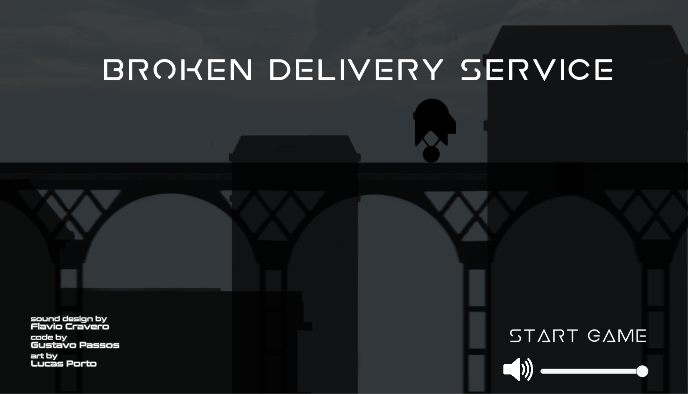

# My experience in the 2020 GMTK Game Jam

<time datetime="2020-08-04">04 August, 2020</time>

This is my experience with the GMTK Game Jam 2020, I hope this might be useful for people that never participated in a Game Jam before or for those that are interested in other team’s experiences.

# The Team

I participated in the jam with [@flaviocravero](https://soundcloud.com/flaviocravero) who did the audio and [@portluc](https://www.deviantart.com/aewron) who created the art, the code was done by me. I was the only one that had participated in a jam before, and even though my first experience was a disaster it served as a guide to cut unnecessary features and test the game often.

# The Game

Broken Delivery Service is the game we came up with our 48 hours, it was made with Unity in C#. You can check it out in [itch.io](https://theguspassos.itch.io/broken-delivery-service).

# The Game Jam Theme

The jam theme was **Out of Control** and we brainstormed lots of ideas before committing to one. We knew that we didn’t have to rush that part since it was pretty important to get a nice idea first, but after some hours we might have started to panic.

We ended up choosing the _no control over when the character will jump mechanic_, and even though it’s an interesting idea we didn’t stop to think if it was going to be used by other teams. I don’t see this as a mistake though, having an idea that’s broadly used is okay if we could design around it in a way that makes it interesting even when compared to other similar games.

# Prototyping

As the art and music was being developed to give a theme to the core mechanic I started to work in a prototype. That was pretty simple and within a few minutes I had a square that jumped once in a while. The feel of controlling this character was rather interesting, it made simple platform challenges become precise timing challenges. We liked how it felt to play it and decided to go with it.

# Gameplay and Narrative

To justify the no control over jump mechanic we wrote this short story about a broken robot that’s delivering a message to someone. Given the fact that we did want the game to feel hard, the message itself was supposed to be a reflection on not having control over things, how hard it can be and why we shouldn’t give up. Something inspired by [Getting Over It with Bennett Foddy](https://store.steampowered.com/app/240720/Getting_Over_It_with_Bennett_Foddy/).

# Creating Levels

We didn’t want to write any tutorial in the game, so we created levels that introduced one “rule” at time, when we later saw people playing the game we could notice that it actually worked, which was pretty cool. Many games in the jam were pretty confusing on its controls, the need to read the manual outside the game is frustrating.

# Polishing

This is the most important part for me, and unfortunetly our inexperience made us lose time with things that should be good right off the bat. The fact that we had many problems with object placement in Unity, camera movement and respawns took time that should be invested in other things.

As I mentioned, having different perspectives in this overused mechanic could make it stand out, so the fact that we didn't polished very well was a big factor for our game not be able to stand out.

If we had added more juice to the jump and made it more clear on when the robot was jumping the game would have a better feel to it. Also, adding different ways to interact with the core mechanic could create more interesting scenarios.

# Results

You can see the ratings for our game on the [submission page](https://itch.io/jam/gmtk-2020/rate/697500). We ranked _#807_ overall, and with 5000+ games submitted I was happy to see our game in the top 15%. However it doesn’t mean it couldn’t have done better, so I took some time to play more games from the jam and think about our ratings to see what we could have done to go further.

## Fun Ratings

There was some feedback on the difficulty and that had an impact in this aspect. This is hard to discuss since it varies from player to player, but when players refer to frustrating scenarios where colliders are missplaced and the margin for error is too thin should definetly be fixed.

I've realized that for a Game Jam submission a hard game might not be the best option, not in the way we did it, since many people won’t be able to finish the game and enjoy the full experience.

## Presentation

We are not sure if everyone was voting based on the art and music or just one of those, so the interpretation might not be right. I think we could have added some visuals like particles and other sound effects, but overall the art and music was great. The game even has an [album](https://soundcloud.com/flaviocravero/sets/broken-delivery-service-official-soundtrack-1) with 3 musics made within the deadline.

## Originality

The idea is cool but we didn’t stop to think if there would be other games doing the same, we just wondered that after the development was going on. We could have made some tweaks on the genre though, just like [one of the winners did](https://leko20.itch.io/restless-wing-syndrome), taking this overused idea and adding some new characteristics to it could have made the game better.

# The overall jam experience

After the deadline I thought it was over, I wasn’t aware that the best part was just starting. Before the ratings were revealed we had one week to play and rate other games

Playing those games was awesome given the fact that we had some kind of connection with the developers, all of us have spent 48 hours giving everything we had to develop a game.

Reading and writing feedback was awesome, seeing other people play our game in different perspectives is exciting too. I’ve seen people do things that I myself stated it wasn’t possible, players ending the game with less deaths than I did and finding the most absurd bugs.

I’m glad to have participated on this jam and I recommend that you do it as well if you have the chance.
